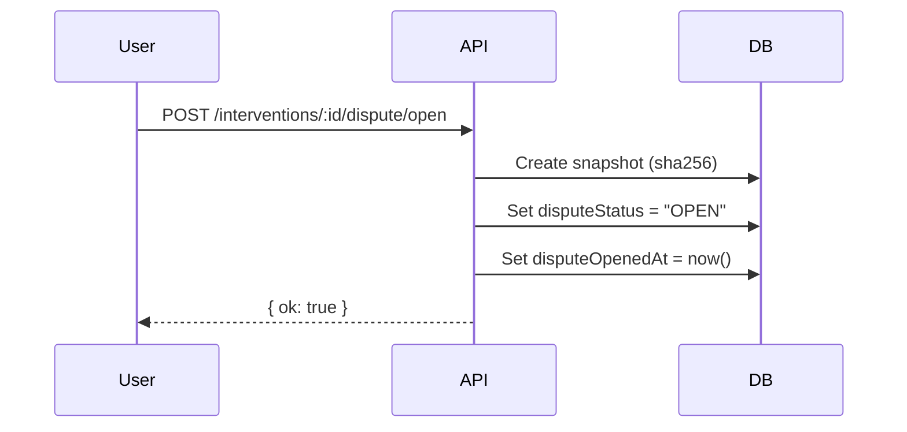
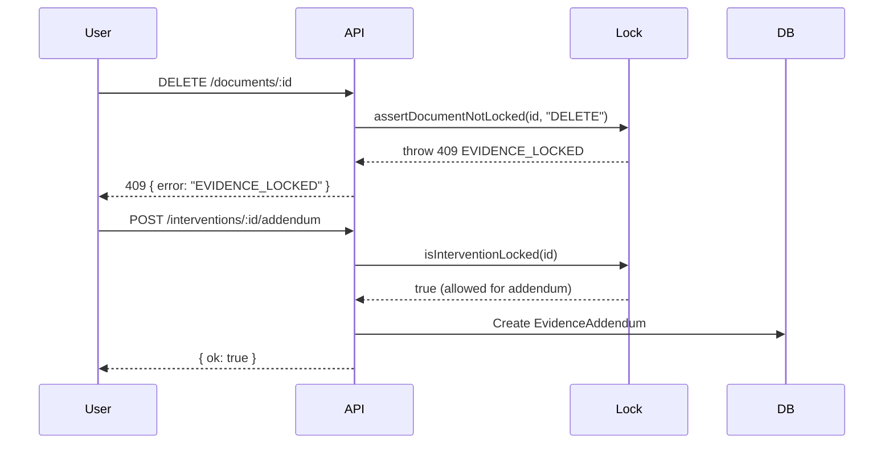
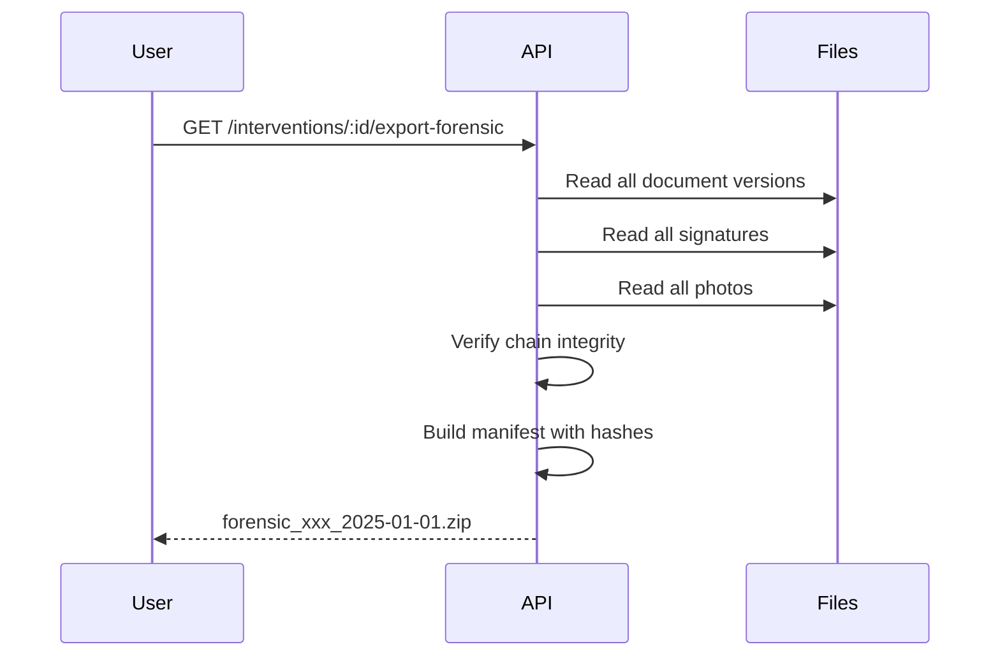

# EVIDENCE-LOCKDOWN-01: Forensic Evidence Lockdown

## Overview

This feature implements forensic evidence lockdown for dispute mode, ensuring that evidence cannot be tampered with during legal proceedings.

## Components

### 1. Database Models

#### `DocumentVersion`
Stores immutable versions of generated PDFs with SHA256 hashes.

```prisma
model DocumentVersion {
  id             String   @id @default(cuid())
  garageId       Int
  interventionId String?
  documentType   String   // "REPAIR_ORDER", "DELIVERY", "RETURN_REPORT", etc.
  documentId     String
  versionNumber  Int
  storageKey     String   // Path to stored file
  sha256         String   // SHA256 hash of the file
  sizeBytes      Int
  mime           String   @default("application/pdf")
  reason         String?  // Why this version was created
  metadata       Json?
  generatedByUserId String?
  generatedAt    DateTime @default(now())
}
```

#### `EvidenceAddendum`
Append-only notes that can be added during dispute mode.

```prisma
model EvidenceAddendum {
  id             String   @id @default(cuid())
  garageId       Int
  interventionId String
  text           String   // The addendum text
  sha256         String   // SHA256 of text
  prevHash       String?  // Hash of previous addendum (chain)
  createdByUserId String
  createdAt      DateTime @default(now())
}
```

### 2. Lock Rules (`lib/legal/evidenceLock.ts`)

When an intervention has `disputeStatus = "OPEN"`:

| Action | Allowed? |
|--------|----------|
| READ | ✅ Yes |
| ADD_PROOF | ✅ Yes |
| ADD_ADDENDUM | ✅ Yes |
| EDIT | ❌ Blocked |
| DELETE | ❌ Blocked |

#### Key Functions

- `isInterventionLocked(interventionId)` - Returns true if intervention is in dispute
- `assertNotLocked(interventionId, action, entityName)` - Throws 409 if locked
- `assertDocumentNotLocked(documentId, action)` - Checks if parent intervention is locked

### 3. API Endpoints

#### `GET /api/interventions/[id]/export-forensic`
Creates a comprehensive forensic ZIP containing:

```
00_manifest/manifest.json      - File list with SHA256 hashes
01_documents/                  - All PDF versions
02_signatures/                 - Signed documents and proofs
03_photos/                     - Attached photos
04_audit/audit.json           - Complete audit trail
05_chain/evidence_chain.json  - Tamper-evident hash chain
06_integrity/integrity_report.txt - Verification report
07_addenda/addenda.json       - Append-only addenda
```

Response Headers:
- `X-Manifest-Hash` - SHA256 of the manifest for verification

#### `POST /api/interventions/[id]/verify-integrity`
Verifies integrity of all evidence:

```json
{
  "ok": true,
  "data": {
    "integrityOk": true,
    "summary": {
      "documentVersionsChecked": 5,
      "documentVersionsOk": 5,
      "signaturesChecked": 2,
      "signaturesOk": 2,
      "chainValid": true,
      "chainEntries": 12
    },
    "issues": []
  }
}
```

#### `POST /api/interventions/[id]/addendum`
Add append-only note during dispute:

```json
{
  "text": "Le client a confirmé verbalement le 15/01/2025..."
}
```

Response:
```json
{
  "ok": true,
  "data": {
    "id": "cuid...",
    "sha256": "abc123...",
    "prevHash": "def456..."
  }
}
```

#### `GET /api/interventions/[id]/addendum`
List all addenda for an intervention.

### 4. Protected Routes

The following routes check for dispute lock:

- `DELETE /api/documents/[id]` - Blocked during dispute
- `PATCH /api/documents/[id]` - Blocked during dispute

### 5. Evidence Chain

Uses existing `lib/legal/evidenceChain.ts` for tamper-evident logging:

```typescript
await addEvidenceEntry({
  garageId,
  userId: user.id,
  entityType: "intervention",
  entityId: interventionId,
  eventType: "ADDENDUM_ADDED",
  payload: { addendumId, textHash },
  reason: "Ajout d'un addendum pendant litige",
  ip: req.headers.get("x-forwarded-for"),
});
```

## Usage Flow

### Opening a Dispute



### During Dispute



### Forensic Export



## Security Considerations

1. **Immutable Versions**: Each PDF generation creates a new `DocumentVersion` with SHA256
2. **Hash Chain**: Evidence chain entries are cryptographically linked
3. **Append-Only**: During dispute, only addenda can be added (no edits/deletes)
4. **Audit Trail**: All actions are logged to `AuditLog`
5. **Integrity Verification**: Hashes can be recalculated and compared

## Testing

```bash
# Run tests
npm run test -- --grep "evidence"

# Manual test sequence
1. Create intervention with documents
2. POST /interventions/:id/dispute/open
3. Try DELETE /documents/:id → should fail with 409
4. POST /interventions/:id/addendum → should succeed
5. GET /interventions/:id/export-forensic → download ZIP
6. POST /interventions/:id/verify-integrity → check report
```

## Retention

Evidence is retained according to `EVIDENCE_10Y` policy (10 years) as defined in `lib/retention.ts`.

## Related Files

- [lib/legal/evidenceLock.ts](../lib/legal/evidenceLock.ts) - Lock rules
- [lib/legal/evidenceChain.ts](../lib/legal/evidenceChain.ts) - Hash chain
- [lib/retention.ts](../lib/retention.ts) - Retention policies
- [prisma/schema.prisma](../prisma/schema.prisma) - Database models
